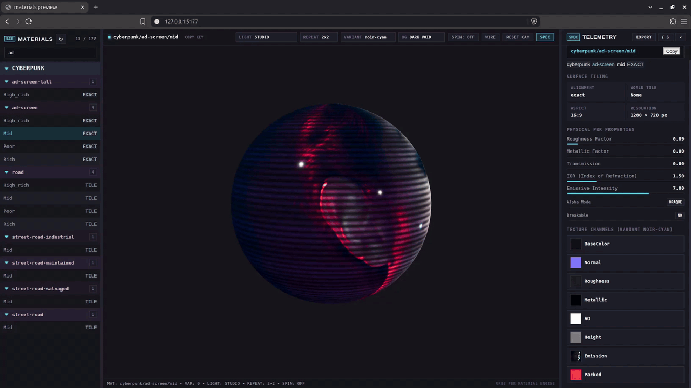
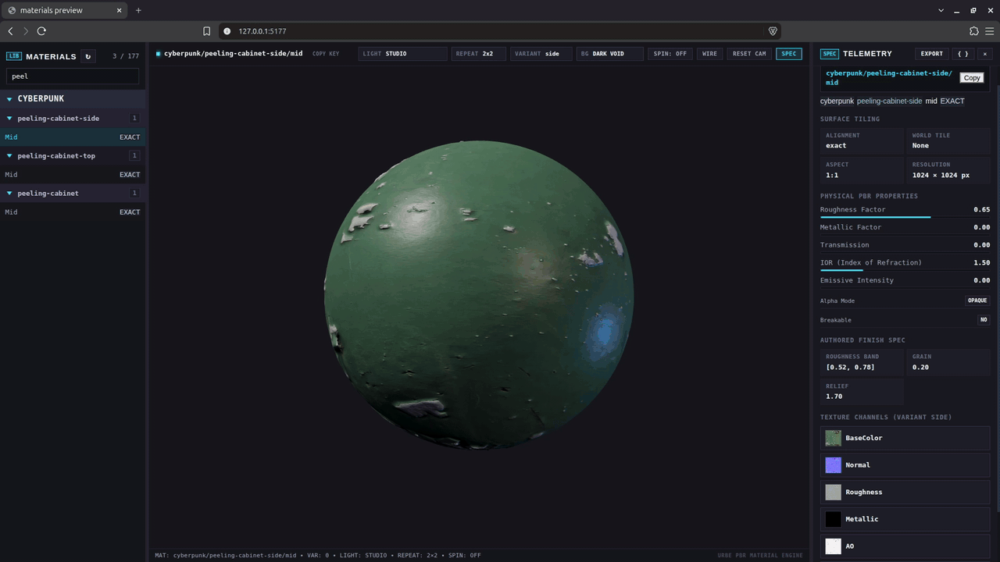
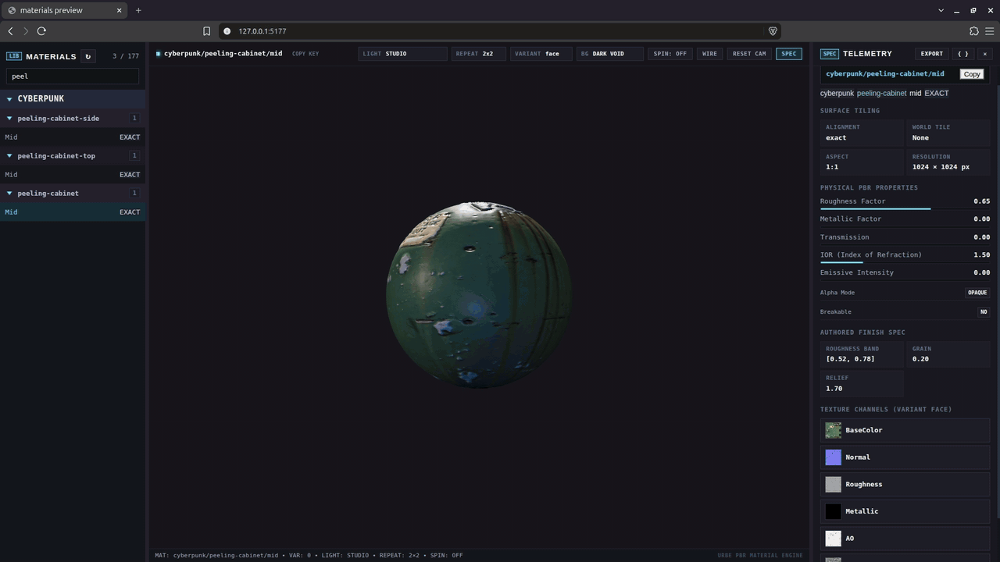

# pbrforge

Version: 0.17.3. A TypeScript PBR material toolkit with a JSON CLI and a Three.js preview. A `theme/kind/tier` key resolves to reusable maps, physical properties and real-world scale.





## Use

```sh
npm install
npm run build
node dist/cli/pbrforge.js doctor
node dist/cli/pbrforge.js list --theme cyberpunk --kind concrete
node dist/cli/pbrforge.js resolve cyberpunk/concrete/mid
```

`node dist/cli/pbrforge.js help` lists authoring and discovery verbs. `--themes <dir>` selects an independent database. The CLI returns one JSON envelope and a process exit code. [SKILL.md](SKILL.md) gives request defaults, errors and a complete local creation example.

```ts
import { resolve } from 'urbe-materials';
const entry = resolve('cyberpunk/window-glass/rich');
```

The package exports `resolve`, `list`, `create`, `refinish`, `rebrand` and `pack`. See the [contract](CONTRACT.md) for inputs, outputs and consumer rules. Finished theme folders work without a generation service or network.

## Author materials

- `from-image` derives dry maps from one opaque JPEG or PNG, including exact object faces and clean repeating fields. It has no seam gate.
- `create` supports photographic generation, local prepared images, procedural patterns, flat finishes, recolor, screens and fitted decals. Tiled create checks seams.
- `refinish` adjusts stored surface response; `rebrand` composites names onto existing screen art; `pack` prepares glTF metallic-roughness maps.

Photographic generation and undersized screen-art upscaling use ComfyUI at `COMFY_URL`, default `http://127.0.0.1:8188`. Local imports and code-generated finishes need no backend. [Backend workflows](templates/README.md) describes the supplied templates. [Agent authoring skill](skills/pbrforge/SKILL.md) routes to photo framing and pattern details.

Keep maps at their authored scale. Geometry supplies UVs, complete panel divisions and fitted artifact placement. Basecolor and emission use sRGB; other maps use linear sampling. Roughness and metallic maps contain absolute values, bound with scalar factors 1.

## Compress maps

KTX Software 4.4.2 is installed in `tools/ktx/` from the official [Linux x86_64 release archive](https://github.com/KhronosGroup/KTX-Software/releases/download/v4.4.2/KTX-Software-4.4.2-Linux-x86_64.tar.bz2). Extract that archive into the folder on a fresh checkout; `tools/ktx/bin/ktx --version` reports `v4.4.2`.

```sh
npm run compress
npm run compress -- --workers 2 --max-temp 90 --force
```

Every unique variant map gets an adjacent KTX2. The command publishes compressed paths by map name in `variant.ktx2`; `variant.maps` retains PNG path strings. Consumers prefer KTX2 and fall back to PNG. Shared maps encode once. Run compression after authoring. Tools and KTX2 outputs stay outside git.

Workers default to one quarter of available CPUs, rounded down with a minimum of one. Each encoder uses one thread. The default ceiling is 90 C; a hot reading narrows admission to one worker until temperature reaches 86 C or lower. Existing parallel jobs finish first. Unreadable sensors report unavailable. Newer KTX2 files are skipped unless `--force` is supplied. [Encoding rules](CONTRACT.md#compression) cover color space, codecs and mipmaps.

Compression contract tests use the installed KTX tool. The authoring preview inspects PNG masters.

## Preview and verify

```sh
npm run preview
npm test
npm run typecheck
npm run build
```

The read-only viewer runs at `http://127.0.0.1:5177`: catalog search, PBR sphere, lighting controls, channel pan/zoom, FIT, 100% and export. `pbrforge preview` reports its status. `npm run sheet -- <kind> [tier]` writes contact sheets to `out/`.

[docs/INDEX.md](docs/INDEX.md) links API surfaces, bindings, sources and pending decisions. Consumers include [Exterior](https://github.com/hec-ovi/buildingforge), [Interior](https://github.com/hec-ovi/interiorforge) and [Urbe](https://github.com/hec-ovi/urbe).
